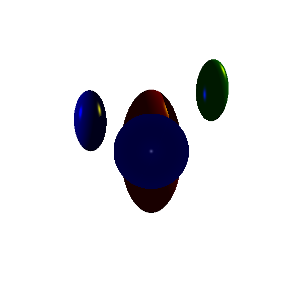
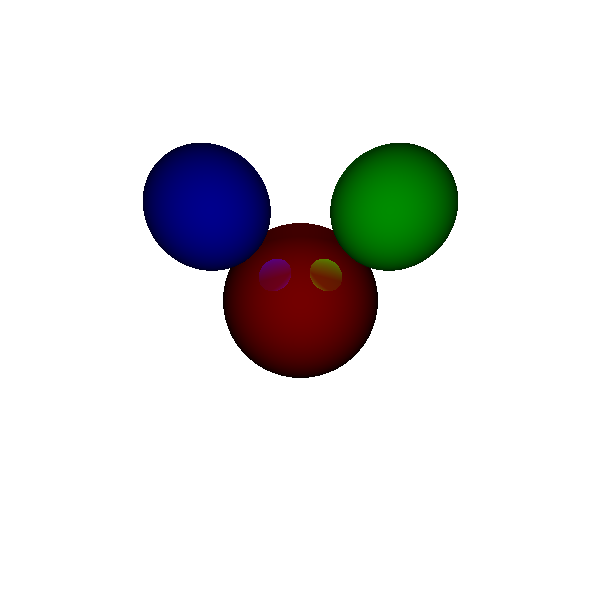
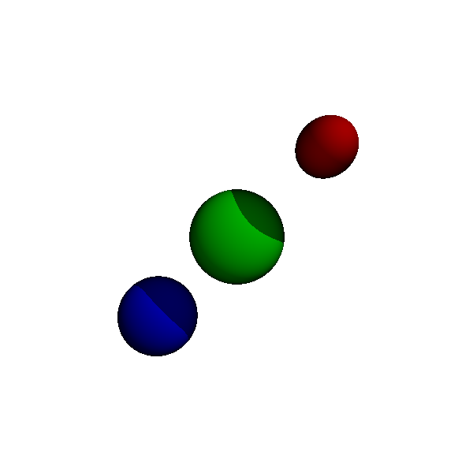

# Simple Ray Tracer

The ray tracer implements all of the following effects:

1) Specular
2) Diffusion
3) Reflection
4) Illumination
5) Ambient
6) Shadows
7) Intersection (partial) Not handled for the near plane

(Some other test cases may also currently be affected by not handling the hollow spheres cut by the near plane)

## Running the Ray Tracer

RayTracer.py: This is the main file and can be run as follows:

```bash
python RayTracer.py <inFile.txt>
```

IOHelper.py: This file handles the parsing of the input file as well as the output file to ppm format.

## Example Output Effects

### Illumination


### Reflection


### Specular


### Shadow

